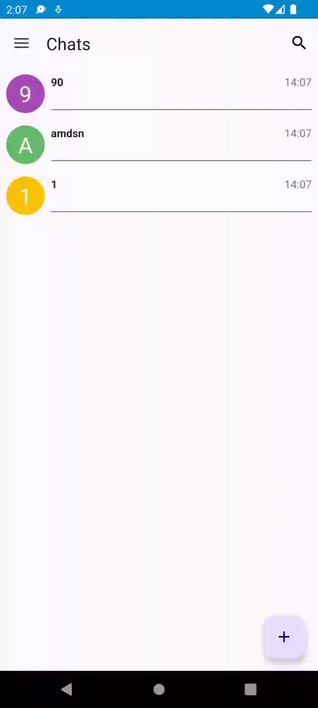

# Athena android native app

## Что это и зачем разрабатывается

Все это приложение - часть большого проекта, который делается в рамках изучения экосистемы Android.
Данный мессенджер подразумевает хорошую защиту пользовательских данных, и во многом похож на все
популярные аналоги. Но так как цель этого проекта - саморазвитие, то по итогу разработка выливается
в некоторого рода челендж :]

В этом проекте я, при помощи моего однокурсника бэкендера [Алексея](https://github.com/Roggired),
опробоваю различные возможности Android SDK, различные библиотеки и архитектурные решения.

На данный момент я успел поработать с:

- Мультимодульная архитектура
- Смесь MVVM и MVI на уровне представления
- Одна Activity и много Fragments, связь между ними при помощи Navigation API
- Для работы с HTTP и Websocket API - OkHttp, Retrofit и Moshi
- Для кэширования данных - Room
- RxJava и Coroutines API
- Hilt в качестве DI фреймворка

## Демонстрация

|  |  |  |
|---------------------------------------------|---------------------------------------------|---------------------------------------------|
|  |  |                                             |

## Что будет дальше?

- Релиз Android нативной версии
- Разработка и релиз IOS нативной версии

## Version notes

### v0.2.1 - In progress

#### Features

- Added pagination and caching for users on CreateChat screen, CHatList screen
- Created Drawer and removed bottom navigation bar
- Migrated on Material3
- Added FAB
- Added CAB for chats multichoice
- Bugfixes

#### Plans

- Very bad realization of rx java, need to study more
- added response error parsing
- вынести пагинацию
- Подумать о времени кэша
- DataStore
- migration on kts configs
- swipes on items
- remade db with caching ONLY last messages
- why ChatListFragmentViewModel trying to load next chats page on logout

#### Inspected

- Rework AppBar with Navigation framework
- Coroutines :]
- add on drawer more info
- TextInputLayout rewrite on
- Add validation on Login screen like on Onboarding
- рефактор логина и профиля
- Add a list of my name convention in fragment and activity

---

### v0.2.0

#### Features

* Added force refresh for users and messages
* Added simple messaging via ws
* Reworked settings page to profile page
* Redesigned login page

#### Plans

* Rework AppBar with Navigation framework
* Think about settings
* Coroutines :]
* TextInputLayout rewrite on
* Add validation on Login screen like on Onboarding
* Think about creating several chats
* Very bad realization of rx java, need to study more
* Add a list of my name convention in fragment and activity
* add chat to chat list

---

### v0.1.4

#### Features

* Now we can create chats with any user which we have in DB
* Auto logining if you have already logined
* Logout button in settings, which will be moved in future

#### Plans

* Rework AppBar with Navigation framework
* Think about settings
* Coroutines :]
* TextInputLayout rewrite on
* Add validation on Login screen like on Onboarding
* Add functionality to buttons in actionbar
* Think about creating several chats

---

### v0.1.3

#### Features

* Added bottom navigation
* Remade activities and fragments structures (check draw.io)

#### Plans

* Rework Login UI
* Add functionality to buttons in actionbar
* Think about settings

---

### v0.1.2

#### Features

* Added Login screen
* Moved to modern API (LocalDateTime instead of Date)

#### Plans

* Add Settings screen
* Add functionality to buttons in actionbar

---

### v0.1.1

#### Features

* UI & UX

    * Troubles with running lib with LocalDateTime, returned to Date  
      So dates in app are very bad right now :]
* Codebase
    * Added base for networking, need Alex to implement in fully

#### Plans

* Adding login screen
* Making dates look better

---

### v0.1.0

#### Features

* Added basic logic of opening chat and writing messages
* Refactoring domain due to Best Practices (BP)

#### Plans

* Adding network infrastructure
* Adding login screen